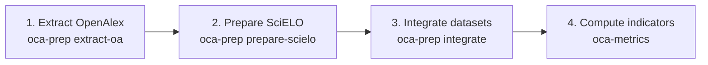

# SciELO OCA Metrics

[English](README.md) | [Português](README.pt.md) | [Español](README.es.md)

---

## English

A Python library and CLI toolset for extracting and computing bibliometric indicators for the SciELO Open Science Observatory (Observatório de Ciência Aberta).

### Structure

- `oca_metrics/adapters`: Adapters for different data sources (Parquet, Elasticsearch, OpenSearch).
- `oca_metrics/preparation`: Data preparation tools (OpenAlex extraction, SciELO processing, integration).
- `oca_metrics/utils`: Utility functions (metrics, normalization).
### Testing

The test suite uses `pytest` and covers normalization, metrics, category loading, adapters, and SciELO data preparation modules.

To run the tests:
```bash
# Install test dependencies
pip install .[test]

# Run pytest
pytest
```

### Installation

```bash
pip install .
```

### Data Sources

- **OpenAlex**: Data is obtained from the OpenAlex snapshot, specifically the SciELO subset. See: https://docs.openalex.org/download-all-data/openalex-snapshot
- **SciELO**: Data is obtained from a MongoDB dump of the ArticleMeta database (internal SciELO infrastructure).

### End-to-End Pipeline (4 stages)

The overall workflow is organized into four stages:

1. Extract OpenAlex works into Parquet (`oca-prep extract-oa`).
2. Prepare and deduplicate SciELO records (`oca-prep prepare-scielo`).
3. Integrate SciELO and OpenAlex into a merged dataset (`oca-prep integrate`).
4. Compute category and journal indicators from the merged Parquet (`oca-metrics`).



### Data Preparation (CLI)

The library provides the `oca-prep` tool to prepare data before metric computation.

#### 1. OpenAlex Extraction
Extracts metrics from compressed OpenAlex JSONL snapshots into Parquet files.
```bash
oca-prep extract-oa --base-dir /path/to/snapshots --output-dir ./oa-parquet
```

#### 2. SciELO Processing
Loads and deduplicates (merges) SciELO documents.
```bash
oca-prep prepare-scielo --input articles.jsonl --output-jsonl scielo_merged.jsonl --strategies doi pid title
```

#### 3. Integration and Merged Parquet Generation
Cross-references SciELO data with OpenAlex and generates the final `merged_data.parquet` dataset.
```bash
oca-prep integrate --scielo-jsonl scielo_merged.jsonl --oa-parquet-dir ./oa-parquet --output-parquet ./merged_data.parquet
```

### Metrics Computation (CLI)

The library provides a command-line tool to compute bibliometric indicators:

```bash
oca-metrics --parquet data.parquet --global-xlsx meta.xlsx --year 2024 --level field
```

Main arguments:
- `--parquet`: Path to the Parquet file (required).
- `--global-xlsx`: Path to the global metadata Excel file.
- `--year`: Specific year for processing.
- `--start-year` / `--end-year`: Year range (defaults to current year).
- `--level`: Aggregation level (`domain`, `field`, `subfield`, `topic`).
- `--output-file`: Output CSV filename.

#### Real computed metrics (table excerpt)

Excerpt from a real run (`metrics_by_field.20260215.csv`, rounded for readability, journal names anonymized):

| Category | Level | Journal | Year | SciELO | Journal publications | Journal citations total | Journal impact normalized | Top 50% publications share (%) |
|:--|:--|:--|--:|--:|--:|--:|--:|--:|
| Agricultural and Biological Sciences | field | Journal A | 2020 | 0 | 57 | 82.0 | 0.1217 | 10.53 |
| Agricultural and Biological Sciences | field | Journal B | 2020 | 0 | 1895 | 2855.0 | 0.1274 | 12.14 |
| Agricultural and Biological Sciences | field | Journal C | 2020 | 1 | 24 | 36.0 | 0.1269 | 4.17 |
| Agricultural and Biological Sciences | field | Journal D | 2020 | 0 | 8 | 25.0 | 0.2643 | 50.00 |

### How to run for all years and all levels

To process all years, use the `--start-year` and `--end-year` arguments to define the desired range. To process all aggregation levels (`domain`, `field`, `subfield`, `topic`), run the command repeatedly, changing the `--level` value each time.

Example (bash):
```bash
for level in domain field subfield topic; do
  oca-metrics --parquet data.parquet --global-xlsx meta.xlsx --start-year 2018 --end-year 2024 --level $level --output-file "metrics_${level}.csv"
done
```
This will generate a CSV for each level, covering all years in the range.

- If you do not provide `--year`, `--start-year`, or `--end-year`, the default is the current year.
- The `--level` argument accepts only one value per execution.

### Supported Adapters

- **Parquet**: Uses DuckDB for efficient processing of local or remote files.
- **Elasticsearch**: (Skeleton) Planned support for ES indices.
- **OpenSearch**: (Skeleton) Planned support for OpenSearch indices.

### Metadata Excel File

The global metadata Excel file (`--global-xlsx`) is used to enrich bibliometric data with journal information. Expected columns are:

| Group | Column Name | Description |
| :--- | :--- | :--- |
| **Journal Info** | `journal_title` | The journal title. |
| | `journal_id` | The journal's OpenAlex identifier (e.g., S123456789). |
| | `publisher_name` | The publisher's name. |
| | `journal_issn` | ISSNs associated with the journal. |
| | `country` | The country responsible for the journal. |
| **SciELO Info** | `is_scielo` | Boolean indicating if the journal belongs to the SciELO network. |
| | `scielo_active_valid` | Journal status in the SciELO network for the given year. |
| | `scielo_collection_acronym` | SciELO collection acronym. |
| **Time** | `publication_year` | The reference year for the metadata. |

The library normalizes the `OpenAlex ID` to the URL format used in Parquet data (e.g., `https://openalex.org/S...`).

### Parquet Schema

The input Parquet file serves as the publication data source. It must contain the following columns to enable metrics computation:

| Group | Column Name | Description |
| :--- | :--- | :--- |
| **Work Info** | `work_id` | Unique identifier for the work (publication). |
| | `publication_year` | Year of publication. |
| | `language` | Publication language. |
| | `doi` | Publication DOI. |
| | `is_merged` | Boolean indicating if the record is merged. |
| | `oa_individual_works` | JSON with individual work details (if merged). |
| | `all_work_ids` | List of all OpenAlex work IDs when 'is_merged' is True. |
| **Source Info** | `source_id` | Source (journal) identifier, typically an OpenAlex URL. |
| | `source_issn_l` | Journal ISSN-L. |
| | `scielo_collection` | SciELO collection of the publication. |
| | `scielo_pid_v2` | SciELO PID v2 of the publication. |
| **Categories** | `domain` | Domain category. |
| | `field` | Field category. |
| | `subfield` | Subfield category. |
| | `topic` | Topic category. |
| | `topic_score` | Topic relevance score. |
| **Citations** | `citations_total` | Total citations received. |
| | `citations_{year}` | Citations received in the respective year. |
| | `citations_window_{w}y` | Citations received in a {w}-year window. |
| | `has_citation_window_{w}y` | Boolean indicating if it has citations in the window. |

### Output CSV Schema

The resulting CSV file contains the computed bibliometric indicators, organized by group:

| Group | Column Name | Description |
| :--- | :--- | :--- |
| **Context** | `category_level` | Aggregation level (e.g., field, subfield). |
| | `category_id` | Category identifier (domain, field, etc.). |
| | `publication_year` | Year of publication. |
| **Journal Info** | `journal_id` | Journal's OpenAlex ID (URL). |
| | `journal_issn` | Journal's ISSN-L. |
| | `journal_title` | Journal title. |
| | `country` | The country responsible for the journal. |
| | `publisher_name` | Publisher name. |
| | `scielo_collection_acronym` | SciELO collection acronym. |
| | `scielo_network_country` | SciELO network country. |
| | `scielo_active_valid` | Journal status in SciELO. |
| | `is_scielo` | Indicator if the journal is in SciELO. |
| **Category Metrics** | `category_publications_count` | Total publications in the category for the year. |
| | `category_citations_total` | Total citations received by the category. |
| | `category_citations_mean` | Mean citations per publication in the category. |
| | `category_citations_total_window_{w}y` | Total citations in the {w}-year window. |
| | `category_citations_mean_window_{w}y` | Mean citations in the {w}-year window. |
| **Journal Metrics** | `journal_publications_count` | Total publications of the journal in the year. |
| | `journal_citations_total` | Total citations received by the journal. |
| | `journal_citations_mean` | Mean citations per journal publication. |
| | `journal_impact_normalized` | Normalized impact (Journal Mean / Category Mean). |
| | `citations_window_{w}y` | Total citations received in the {w}-year window. |
| | `citations_window_{w}y_works` | Number of works with at least 1 citation in the window. |
| | `journal_citations_mean_window_{w}y` | Mean citations in the {w}-year window. |
| | `journal_impact_normalized_window_{w}y` | Normalized impact in the {w}-year window. |
| **Percentile Metrics** | `top_{pct}pct_all_time_citations_threshold` | Citation threshold for top {pct}% (all time). |
| | `top_{pct}pct_all_time_publications_count` | Number of publications in top {pct}% (all time). |
| | `top_{pct}pct_all_time_publications_share_pct` | Share (%) of publications in top {pct}% (all time). |
| | `top_{pct}pct_window_{w}y_citations_threshold` | Citation threshold for top {pct}% in {w}-year window. |
| | `top_{pct}pct_window_{w}y_publications_count` | Number of publications in top {pct}% in {w}-year window. |
| | `top_{pct}pct_window_{w}y_publications_share_pct` | Share (%) of publications in top {pct}% in {w}-year window. |

> **Note**: `{w}` represents the window size (e.g., 2, 3, 5) and `{pct}` represents the percentile (e.g., 1, 5, 10, 50).

---

## How SciELO and OpenAlex Document Merging Works

The merging process involves several steps and can be customized using merge strategies (e.g., `--strategies doi pid title`):

1. **SciELO-SciELO Merging**:
   - **doi**: Articles are grouped if they share a DOI (main or language-specific) and overlapping titles.
   - **pid**: Articles are grouped if they share PIDv2, publication year, journal (by ISSN or title), and overlapping titles.
   - **title**: Articles are grouped if they share a (non-generic) title, publication year, and journal (by ISSN or title).

2. **SciELO-OpenAlex Linking**:
   - All DOIs from each merged SciELO article are used to find matching OpenAlex works.
   - When multiple OpenAlex records match a single SciELO article, their metrics are consolidated.

3. **OpenAlex Metrics Consolidation**:
   - For each SciELO article, all matched OpenAlex works have their metrics aggregated.
   - Individual metrics per OpenAlex work are preserved, and global totals are computed.

There is no explicit merging between OpenAlex works themselves; instead, all OpenAlex works matching a SciELO article are consolidated under that article, removing duplicates where necessary.

This multi-step process ensures that each article is uniquely represented, with all relevant metrics and metadata consolidated from both SciELO and OpenAlex sources.

### Multilingual Articles and Metric Calculation

A single article published in multiple languages (e.g., three versions) is represented in OpenAlex as three separate documents—one for each language version. In SciELO, these are considered a single article. This distinction affects metric calculations: counting each OpenAlex document separately would inflate the number of published articles.

To address this, the merging process consolidates all language versions and their citations into a single article. This ensures that the total contribution of the article is accurately computed, reflecting all versions and citations without duplication.

### Example merged record

Illustrative example (`is_merged = true`):

| work_id | all_work_ids | scielo_pid_v2 | publication_year | citations_total | citations_window_2y | citations_window_3y | citations_window_5y |
|:--|:--|:--|--:|--:|--:|--:|--:|
| https://openalex.org/W1 | [https://openalex.org/W1, https://openalex.org/W2] | [S0001] | 2021 | 15 | 3 | 5 | 8 |

In this example, the final record consolidates two OpenAlex works (W1 and W2) linked to the same SciELO article.

---

## Category classification and metric mathematics

Articles are classified into four hierarchical categories: **domain**, **field**, **subfield**, and **topic**. All bibliometric metrics are calculated and normalized within each category and publication year. This allows fair comparison between journals from different areas, as each journal is evaluated relative to its reference group.

### Symbol legend

- $c$: category (domain, field, subfield, or topic)
- $y$: publication year
- $j$: journal
- $w$: citation window in years (e.g., 2, 3, 5)
- $i$: publication index
- $N$: publication count
- $C$: citation count
- $\bar{C}$: mean citations per publication
- $Q_p$: percentile function at percentile $p$
- $p$: percentile used for threshold calculation (99, 95, 90, 50)
- $q$: top share in percent (1, 5, 10, 50), with $q=100-p$

### Normalization by category and year

For each category $c$ and year $y$, we calculate:

- Total publications: $N_{c,y}$
- Total citations: $C_{c,y}$
- Mean citations per publication:

$$
\bar{C}_{c,y} = \frac{C_{c,y}}{N_{c,y}}
$$

- Citations in time window $w$:
  - $C_{c,y}^{(w)}$: total citations in window $w$
- Mean citations in time window $w$:

$$
\bar{C}_{c,y}^{(w)} = \frac{C_{c,y}^{(w)}}{N_{c,y}}
$$

### Journal metrics

For each journal $j$ in category $c$ and year $y$:

- Total publications: $N_{j,c,y}$
- Total citations: $C_{j,c,y}$
- Mean citations per publication:

$$
\bar{C}_{j,c,y} = \frac{C_{j,c,y}}{N_{j,c,y}}
$$

- Citations in time window $w$:
  - $C_{j,c,y}^{(w)}$: total citations in window $w$
- Mean citations in time window $w$:

$$
\bar{C}_{j,c,y}^{(w)} = \frac{C_{j,c,y}^{(w)}}{N_{j,c,y}}
$$

### Normalized impact

The normalized impact of the journal is computed with a zero-denominator guard:

$$
I_{j,c,y} =
\begin{cases}
0, & \text{if } \bar{C}_{c,y}=0 \\
\frac{\bar{C}_{j,c,y}}{\bar{C}_{c,y}}, & \text{otherwise}
\end{cases}
$$

And for time windows:

$$
I_{j,c,y}^{(w)} =
\begin{cases}
0, & \text{if } \bar{C}_{c,y}^{(w)}=0 \\
\frac{\bar{C}_{j,c,y}^{(w)}}{\bar{C}_{c,y}^{(w)}}, & \text{otherwise}
\end{cases}
$$

### Percentiles and thresholds

Thresholds are computed for percentiles $p \in \{99,95,90,50\}$, which correspond to top shares $q \in \{1,5,10,50\}$ where $q=100-p$.

For all citations in category $c$ and year $y$:

$$
T_{c,y}^{(q)} = \left\lfloor Q_p\left(\mathcal{C}_{c,y}\right) \right\rfloor + 1
$$

And for a citation window $w$:

$$
T_{c,y}^{(q,w)} = \left\lfloor Q_p\left(\mathcal{C}_{c,y}^{(w)}\right) \right\rfloor + 1
$$

Journal counts in top $q$% are:

$$
N_{j,c,y}^{(q)} = \sum_{i \in (j,c,y)} \mathbf{1}\!\left(C_{i,c,y} \ge T_{c,y}^{(q)}\right)
$$

$$
N_{j,c,y}^{(q,w)} = \sum_{i \in (j,c,y)} \mathbf{1}\!\left(C_{i,c,y}^{(w)} \ge T_{c,y}^{(q,w)}\right)
$$

And publication share is:

$$
S_{j,c,y}^{(q)} = \frac{N_{j,c,y}^{(q)}}{N_{j,c,y}} \times 100
$$

$$
S_{j,c,y}^{(q,w)} = \frac{N_{j,c,y}^{(q,w)}}{N_{j,c,y}} \times 100
$$

### Practical example

If a journal has 20 articles in a category in 2024, with 100 total citations:

- $\bar{C}_{j,c,2024} = \frac{100}{20} = 5$ citations per article
- If the category mean is 4, then $I_{j,c,2024} = \frac{5}{4} = 1.25$
- If the top 5% threshold is $T_{c,2024}^{(5)}=11$ and 2 articles are above this threshold, then $S_{j,c,2024}^{(5)} = \frac{2}{20} \times 100 = 10\%$

These formulas allow understanding and comparing journal performance in each area, adjusting for differences in size and impact.

## Limitations and Coverage

Only SciELO articles with OpenAlex taxonomy (domain, field, subfield, topic) are included in category-based metrics. That is, only those matched in OpenAlex are counted in denominators for totals, averages, and percentiles. SciELO articles without an OpenAlex match appear in the final Parquet with zero citations, but are ignored in category metrics because they lack taxonomy.

Nevertheless, it is important to monitor OpenAlex coverage: areas or journals with low matching may have underestimated or less representative metrics. Always check the proportion of unmatched SciELO articles (by journal, year, and category) before interpreting results.

### How to audit coverage (unmatched articles)

After running the integration step (`oca-prep integrate`), a Parquet file named `unmatched_scielo.parquet` is generated in the output directory. This file contains all SciELO articles that were not matched to any OpenAlex record. You can analyze this file directly to assess coverage and investigate unmatched articles:

```python
import pandas as pd
unmatched = pd.read_parquet('unmatched_scielo.parquet')
print(unmatched.head())
print(f"Total unmatched: {len(unmatched)}")
```

Example of real output from `unmatched.head()` (integration fixture):

| work_id      | publication_year | doi         | citations_total | domain | field | subfield | topic |
|:-------------|-----------------:|:------------|----------------:|:-------|:------|:---------|:------|
| scielo:S0002 |             2024 | 10.1001/999 |               0 |        |       |          |       |

## References

- Bibliometric positioning and percentile-based indicators in this project were inspired by the Leiden Ranking indicator documentation (CWTS Leiden Ranking): https://traditional.leidenranking.com/information/indicators
- The taxonomy mapping used for OpenAlex categories (domain, field, subfield, topic) was based on the OpenAlex topic-classification repository: https://github.com/ourresearch/openalex-topic-classification
- Additional methodological details for the OpenAlex topic-classification system were consulted in the public methodology document: https://docs.google.com/document/d/1bDopkhuGieQ4F8gGNj7sEc8WSE8mvLZS/edit#heading=h.5w2tb5fcg77r
