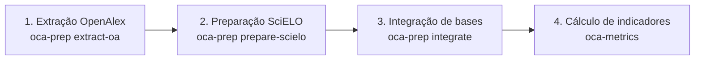

# SciELO OCA Metrics

[English](README.md) | [Português](README.pt.md) | [Español](README.es.md)

---

## Português

Uma biblioteca Python e conjunto de ferramentas CLI para extração e computação de indicadores bibliométricos para o Observatório de Ciência Aberta da SciELO.

### Estrutura

- `oca_metrics/adapters`: Adaptadores para diferentes fontes de dados (Parquet, Elasticsearch, OpenSearch).
- `oca_metrics/preparation`: Ferramentas para preparação de dados (extração OpenAlex, processamento SciELO, integração).
- `oca_metrics/utils`: Funções utilitárias (métricas, normalização).
### Testes

A suíte de testes utiliza `pytest` e cobre os módulos de normalização, métricas, carregamento de categorias, adaptadores e preparação de dados SciELO.

Para executar os testes:
```bash
# Instale as dependências de teste
pip install .[test]

# Execute o pytest
pytest
```

### Instalação

```bash
pip install .
```

### Fontes de Dados

- **OpenAlex**: Os dados são obtidos do snapshot do OpenAlex, especificamente do subconjunto Works. Veja: https://docs.openalex.org/download-all-data/openalex-snapshot
- **SciELO**: Os dados são obtidos de um dump MongoDB do banco ArticleMeta (infraestrutura interna da SciELO).

### Pipeline ponta a ponta (4 etapas)

O fluxo geral está organizado em quatro etapas:

1. Extrair trabalhos OpenAlex para Parquet (`oca-prep extract-oa`).
2. Preparar e deduplicar registros SciELO (`oca-prep prepare-scielo`).
3. Integrar SciELO e OpenAlex em um dataset mesclado (`oca-prep integrate`).
4. Computar indicadores por categoria e periódico a partir do Parquet mesclado (`oca-metrics`).



### Preparação de Dados (CLI)

A biblioteca fornece a ferramenta `oca-prep` para preparar os dados antes da computação das métricas.

#### 1. Extração do OpenAlex
Extrai métricas de snapshots JSONL comprimidos do OpenAlex para arquivos Parquet.
```bash
oca-prep extract-oa --base-dir /caminho/snapshots --output-dir ./oa-parquet
```

#### 2. Processamento SciELO
Carrega e remove duplicatas (merge) de documentos SciELO.
```bash
oca-prep prepare-scielo --input articles.jsonl --output-jsonl scielo_merged.jsonl --strategies doi pid title
```

#### 3. Integração e Geração de Parquet Mesclado
Cruza os dados SciELO com OpenAlex e gera o dataset final `merged_data.parquet`.
```bash
oca-prep integrate --scielo-jsonl scielo_merged.jsonl --oa-parquet-dir ./oa-parquet --output-parquet ./merged_data.parquet
```

### Computação de Métricas (CLI)

A biblioteca fornece uma ferramenta de linha de comando para computar indicadores bibliométricos:

```bash
oca-metrics --parquet data.parquet --global-xlsx meta.xlsx --year 2024 --level field
```

Argumentos principais:
- `--parquet`: Caminho para o arquivo Parquet (obrigatório).
- `--global-xlsx`: Caminho para o arquivo Excel de metadados globais.
- `--year`: Ano específico para processamento.
- `--start-year` / `--end-year`: Intervalo de anos (o padrão é o ano atual).
- `--level`: Nível de agregação (`domain`, `field`, `subfield`, `topic`).
- `--output-file`: Nome do arquivo CSV de saída.

#### Exemplo real de métricas computadas (trecho em tabela)

Trecho de uma execução real (`metrics_by_field.20260215.csv`, valores arredondados para leitura e nomes de periódicos anonimizados):

| Categoria | Nível | Periódico | Ano | SciELO | Publicações do periódico | Citações totais do periódico | Impacto normalizado do periódico | Percentual de publicações no top 50% |
|:--|:--|:--|--:|--:|--:|--:|--:|--:|
| Agricultural and Biological Sciences | field | Journal A | 2020 | 0 | 57 | 82.0 | 0.1217 | 10.53 |
| Agricultural and Biological Sciences | field | Journal B | 2020 | 0 | 1895 | 2855.0 | 0.1274 | 12.14 |
| Agricultural and Biological Sciences | field | Journal C | 2020 | 1 | 24 | 36.0 | 0.1269 | 4.17 |
| Agricultural and Biological Sciences | field | Journal D | 2020 | 0 | 8 | 25.0 | 0.2643 | 50.00 |

### Como rodar para todos os anos e todos os níveis

Para processar todos os anos, utilize os argumentos `--start-year` e `--end-year` para definir o intervalo desejado. Para processar todos os níveis de agregação (`domain`, `field`, `subfield`, `topic`), execute o comando repetidamente, mudando o valor de `--level` em cada execução.

Exemplo (bash):
```bash
for level in domain field subfield topic; do
  oca-metrics --parquet data.parquet --global-xlsx meta.xlsx --start-year 2018 --end-year 2024 --level $level --output-file "metrics_${level}.csv"
done
```
Isso irá gerar um CSV para cada nível, cobrindo todos os anos do intervalo.

- Se não passar `--year`, `--start-year` ou `--end-year`, o padrão é o ano atual.
- O argumento `--level` aceita apenas um valor por execução.

### Adaptadores Suportados

- **Parquet**: Usa DuckDB para processamento eficiente de arquivos locais ou remotos.
- **Elasticsearch**: (Esqueleto) Suporte planejado para índices ES.
- **OpenSearch**: (Esqueleto) Suporte planejado para índices OpenSearch.

### Arquivo Excel de Metadados

O arquivo Excel de metadados globais (`--global-xlsx`) é usado para enriquecer os dados bibliométricos com informações dos periódicos. As colunas esperadas são:

| Grupo | Nome da Coluna | Descrição |
| :--- | :--- | :--- |
| **Info Periódico** | `journal_title` | O título do periódico. |
| | `journal_id` | O identificador OpenAlex do periódico (ex: S123456789). |
| | `publisher_name` | O nome da editora. |
| | `journal_issn` | Os ISSNs associados ao periódico. |
| | `country` | O país responsável pelo periódico. |
| **Info SciELO** | `is_scielo` | Booleano indicando se o periódico pertence à rede SciELO. |
| | `scielo_active_valid` | Status do periódico na rede SciELO para o ano dado. |
| | `scielo_collection_acronym` | Acrônimo da coleção SciELO. |
| **Tempo** | `publication_year` | O ano de referência para os metadados. |

A biblioteca normaliza o `OpenAlex ID` para o formato de URL usado nos dados Parquet (ex: `https://openalex.org/S...`).

### Schema do Parquet

O arquivo Parquet de entrada serve como fonte dos dados de publicação. Ele deve conter as seguintes colunas para permitir a computação das métricas:

| Grupo | Nome da Coluna | Descrição |
| :--- | :--- | :--- |
| **Info Trabalho** | `work_id` | Identificador único do trabalho (publicação). |
| | `publication_year` | Ano de publicação. |
| | `language` | Idioma da publicação. |
| | `doi` | DOI da publicação. |
| | `is_merged` | Booleano indicando se o registro é mesclado. |
| | `oa_individual_works` | JSON com detalhes dos trabalhos individuais (se mesclado). |
| | `all_work_ids` | Lista de todos os IDs dos trabalhos na base OpenAlex quando 'is_merged' for True. |
| **Info Fonte** | `source_id` | Identificador da fonte (periódico), tipicamente uma URL OpenAlex. |
| | `source_issn_l` | ISSN-L do periódico. |
| | `scielo_collection` | Coleção SciELO da publicação. |
| | `scielo_pid_v2` | PID v2 SciELO da publicação. |
| **Categorias** | `domain` | Categoria de domínio. |
| | `field` | Categoria de campo. |
| | `subfield` | Categoria de subcampo. |
| | `topic` | Categoria de tópico. |
| | `topic_score` | Score de relevância do tópico. |
| **Citações** | `citations_total` | Total de citações recebidas. |
| | `citations_{year}` | Citações recebidas no respectivo ano. |
| | `citations_window_{w}y` | Citações recebidas em uma janela de {w} anos. |
| | `has_citation_window_{w}y` | Booleano indicando se possui citações na janela. |

### Schema do CSV de Saída

O arquivo CSV resultante contém os indicadores bibliométricos computados, organizados por grupo:

| Grupo | Nome da Coluna | Descrição |
| :--- | :--- | :--- |
| **Contexto** | `category_level` | Nível de agregação (ex: field, subfield). |
| | `category_id` | Identificador da categoria (domain, field, etc.). |
| | `publication_year` | Ano de publicação. |
| **Info Periódico** | `journal_id` | OpenAlex ID (URL) do periódico. |
| | `journal_issn` | ISSN-L do periódico. |
| | `journal_title` | Título do periódico. |
| | `country` | O país responsável pelo periódico. |
| | `publisher_name` | Nome da editora. |
| | `scielo_collection_acronym` | Acrônimo da coleção SciELO. |
| | `scielo_network_country` | País da rede SciELO. |
| | `scielo_active_valid` | Status do periódico no SciELO. |
| | `is_scielo` | Indicador se o periódico está no SciELO. |
| **Métricas Categoria** | `category_publications_count` | Total de publicações na categoria no ano. |
| | `category_citations_total` | Total de citações recebidas pela categoria. |
| | `category_citations_mean` | Média de citações por publicação na categoria. |
| | `category_citations_total_window_{w}y` | Total de citações na janela de {w} anos. |
| | `category_citations_mean_window_{w}y` | Média de citações na janela de {w} anos. |
| **Métricas Periódico** | `journal_publications_count` | Total de publicações do periódico no ano. |
| | `journal_citations_total` | Total de citações recebidas pelo periódico. |
| | `journal_citations_mean` | Média de citações por publicação do periódico. |
| | `journal_impact_normalized` | Impacto normalizado (Média Periódico / Média Categoria). |
| | `citations_window_{w}y` | Total de citações recebidas na janela de {w} anos. |
| | `citations_window_{w}y_works` | Número de trabalhos com ao menos 1 citação na janela. |
| | `journal_citations_mean_window_{w}y` | Média de citações na janela de {w} anos. |
| | `journal_impact_normalized_window_{w}y` | Impacto normalizado na janela de {w} anos. |
| **Métricas Percentil** | `top_{pct}pct_all_time_citations_threshold` | Threshold de citações para o top {pct}% (todo o tempo). |
| | `top_{pct}pct_all_time_publications_count` | Número de publicações no top {pct}% (todo o tempo). |
| | `top_{pct}pct_all_time_publications_share_pct` | Percentual de publicações no top {pct}% (todo o tempo). |
| | `top_{pct}pct_window_{w}y_citations_threshold` | Threshold de citações para o top {pct}% na janela de {w} anos. |
| | `top_{pct}pct_window_{w}y_publications_count` | Número de publicações no top {pct}% na janela de {w} anos. |
| | `top_{pct}pct_window_{w}y_publications_share_pct` | Percentual de publicações no top {pct}% na janela de {w} anos. |

> **Nota**: `{w}` representa o tamanho da janela (ex: 2, 3, 5) e `{pct}` representa o percentil (ex: 1, 5, 10, 50).

---

## Como funciona a mescla de documentos SciELO e OpenAlex

O processo de mescla ocorre em várias etapas e pode ser personalizado via estratégias de mesclagem (ex: `--strategies doi pid title`):

1. **Mescla SciELO-SciELO**:
   - **doi**: Artigos são agrupados se compartilham DOI (principal ou por idioma) e títulos sobrepostos.
   - **pid**: Artigos são agrupados se compartilham PIDv2, ano de publicação, periódico (por ISSN ou título) e títulos sobrepostos.
   - **title**: Artigos são agrupados se compartilham título (não genérico), ano de publicação e periódico (por ISSN ou título).

2. **Vinculação SciELO-OpenAlex**:
   - Todos os DOIs de cada artigo SciELO mesclado são usados para buscar correspondências em OpenAlex.
   - Quando múltiplos registros OpenAlex correspondem a um SciELO, as métricas são consolidadas.

3. **Consolidação de métricas OpenAlex**:
   - Para cada artigo SciELO, todos os trabalhos OpenAlex encontrados têm suas métricas agregadas.
   - As métricas individuais de cada trabalho OpenAlex são preservadas, e totais globais são computados.

Não há uma mescla explícita entre trabalhos OpenAlex; todos os trabalhos OpenAlex que correspondem a um SciELO são consolidados sob esse artigo, removendo duplicatas quando necessário.

Esse processo garante que cada artigo seja representado de forma única, com todos os metadados e métricas relevantes consolidados das fontes SciELO e OpenAlex.

### Artigos multilíngues e cálculo de métricas

Um único artigo publicado em múltiplos idiomas (por exemplo, três versões) é representado na OpenAlex como três documentos separados—um para cada versão. Na SciELO, eles são considerados um só artigo. Essa distinção afeta o cálculo das métricas: contar cada documento OpenAlex separadamente inflaria o número de artigos publicados.

Para evitar isso, o processo de mescla consolida todas as versões e suas citações em um único artigo. Assim, a contribuição total do artigo é computada corretamente, refletindo todas as versões e citações sem duplicidade.

### Exemplo de registro mesclado

Exemplo ilustrativo (`is_merged = true`):

| work_id | all_work_ids | scielo_pid_v2 | publication_year | citations_total | citations_window_2y | citations_window_3y | citations_window_5y |
|:--|:--|:--|--:|--:|--:|--:|--:|
| https://openalex.org/W1 | [https://openalex.org/W1, https://openalex.org/W2] | [S0001] | 2021 | 15 | 3 | 5 | 8 |

Neste exemplo, o registro final consolida dois trabalhos OpenAlex (W1 e W2) vinculados ao mesmo artigo SciELO.

---

## Classificação de categorias e matemática das métricas

Os artigos são classificados em quatro categorias hierárquicas: **domain**, **field**, **subfield** e **topic**. Todas as métricas bibliométricas são calculadas e normalizadas dentro de cada categoria e ano de publicação. Isso permite comparar periódicos de áreas diferentes de forma justa, pois cada periódico é avaliado em relação ao seu grupo de referência.

### Legenda de símbolos

- $c$: categoria (domain, field, subfield ou topic)
- $y$: ano de publicação
- $j$: periódico
- $w$: janela de citação em anos (ex: 2, 3, 5)
- $i$: índice da publicação
- $N$: quantidade de publicações
- $C$: quantidade de citações
- $\bar{C}$: média de citações por publicação
- $Q_p$: função de percentil no percentil $p$
- $p$: percentil usado no cálculo do threshold (99, 95, 90, 50)
- $q$: top em percentual (1, 5, 10, 50), com $q=100-p$

### Normalização por categoria e ano

Para cada categoria $c$ e ano $y$, calculamos:

- Total de publicações: $N_{c,y}$
- Total de citações: $C_{c,y}$
- Média de citações por publicação:

$$
\bar{C}_{c,y} = \frac{C_{c,y}}{N_{c,y}}
$$

- Citações na janela de tempo $w$:
  - $C_{c,y}^{(w)}$: total de citações na janela $w$
- Média de citações na janela de tempo $w$:

$$
\bar{C}_{c,y}^{(w)} = \frac{C_{c,y}^{(w)}}{N_{c,y}}
$$

### Métricas de periódicos

Para cada periódico $j$ na categoria $c$ e ano $y$:

- Total de publicações: $N_{j,c,y}$
- Total de citações: $C_{j,c,y}$
- Média de citações por publicação:

$$
\bar{C}_{j,c,y} = \frac{C_{j,c,y}}{N_{j,c,y}}
$$

- Citações na janela de tempo $w$:
  - $C_{j,c,y}^{(w)}$: total de citações na janela $w$
- Média de citações na janela de tempo $w$:

$$
\bar{C}_{j,c,y}^{(w)} = \frac{C_{j,c,y}^{(w)}}{N_{j,c,y}}
$$

### Impacto normalizado

O impacto normalizado do periódico é calculado com proteção para denominador zero:

$$
I_{j,c,y} =
\begin{cases}
0, & \text{se } \bar{C}_{c,y}=0 \\
\frac{\bar{C}_{j,c,y}}{\bar{C}_{c,y}}, & \text{caso contrário}
\end{cases}
$$

E para janelas de tempo:

$$
I_{j,c,y}^{(w)} =
\begin{cases}
0, & \text{se } \bar{C}_{c,y}^{(w)}=0 \\
\frac{\bar{C}_{j,c,y}^{(w)}}{\bar{C}_{c,y}^{(w)}}, & \text{caso contrário}
\end{cases}
$$

### Percentis e thresholds

Os thresholds são calculados para percentis $p \in \{99,95,90,50\}$, que correspondem aos tops $q \in \{1,5,10,50\}$ onde $q=100-p$.

Para todas as citações na categoria $c$ e ano $y$:

$$
T_{c,y}^{(q)} = \left\lfloor Q_p\left(\mathcal{C}_{c,y}\right) \right\rfloor + 1
$$

E para uma janela de citações $w$:

$$
T_{c,y}^{(q,w)} = \left\lfloor Q_p\left(\mathcal{C}_{c,y}^{(w)}\right) \right\rfloor + 1
$$

As contagens do periódico no top $q$% são:

$$
N_{j,c,y}^{(q)} = \sum_{i \in (j,c,y)} \mathbf{1}\!\left(C_{i,c,y} \ge T_{c,y}^{(q)}\right)
$$

$$
N_{j,c,y}^{(q,w)} = \sum_{i \in (j,c,y)} \mathbf{1}\!\left(C_{i,c,y}^{(w)} \ge T_{c,y}^{(q,w)}\right)
$$

E o percentual de publicações é:

$$
S_{j,c,y}^{(q)} = \frac{N_{j,c,y}^{(q)}}{N_{j,c,y}} \times 100
$$

$$
S_{j,c,y}^{(q,w)} = \frac{N_{j,c,y}^{(q,w)}}{N_{j,c,y}} \times 100
$$

### Exemplo prático

Se um periódico tem 20 artigos em uma categoria em 2024, com 100 citações totais, então:

- $\bar{C}_{j,c,2024} = \frac{100}{20} = 5$ citações por artigo
- Se a média da categoria é 4, então $I_{j,c,2024} = \frac{5}{4} = 1.25$
- Se o threshold do top 5% é $T_{c,2024}^{(5)}=11$ e 2 artigos estão acima desse threshold, então $S_{j,c,2024}^{(5)} = \frac{2}{20} \times 100 = 10\%$

Essas fórmulas permitem entender e comparar o desempenho dos periódicos em cada área, ajustando para diferenças de tamanho e impacto.

## Limitações e Cobertura

Apenas artigos SciELO que possuem taxonomia OpenAlex (domain, field, subfield, topic) entram nos cálculos das métricas por categoria. Ou seja, somente os que deram match em OpenAlex são considerados nos denominadores de totais, médias e percentis. Artigos SciELO sem correspondência em OpenAlex aparecem no Parquet final com citações zeradas, mas são ignorados nos cálculos por categoria, pois não têm taxonomia.

Ainda assim, é importante monitorar a cobertura do OpenAlex: áreas ou periódicos com baixa correspondência podem ter métricas subestimadas ou pouco representativas. Recomendamos sempre verificar a proporção de artigos SciELO sem match em OpenAlex (por periódico, ano e categoria) antes de interpretar os resultados. Um relatório de cobertura pode ser gerado nos logs para maior transparência.

### Como auditar a cobertura (artigos não pareados)

Após rodar a etapa de integração (`oca-prep integrate`), um arquivo Parquet chamado `unmatched_scielo.parquet` é gerado no diretório de saída. Esse arquivo contém todos os artigos SciELO que não foram pareados com registros do OpenAlex. Você pode analisar esse arquivo diretamente para avaliar a cobertura e investigar os artigos não pareados:

```python
import pandas as pd
unmatched = pd.read_parquet('unmatched_scielo.parquet')
print(unmatched.head())
print(f"Total não pareados: {len(unmatched)}")
```

Exemplo de saída real do `unmatched.head()` (fixture de integração):

| work_id      | publication_year | doi         | citations_total | domain | field | subfield | topic |
|:-------------|-----------------:|:------------|----------------:|:-------|:------|:---------|:------|
| scielo:S0002 |             2024 | 10.1001/999 |               0 |        |       |          |       |

## Referências

- As medidas de posicionamento bibliométrico e os indicadores percentílicos deste projeto foram inspirados na documentação de indicadores do Leiden Ranking (CWTS Leiden Ranking): https://traditional.leidenranking.com/information/indicators
- O mapeamento taxonômico usado para as categorias OpenAlex (domain, field, subfield, topic) foi baseado no repositório de classificação de tópicos do OpenAlex: https://github.com/ourresearch/openalex-topic-classification
- Detalhes metodológicos adicionais sobre o sistema de classificação de tópicos do OpenAlex foram consultados no documento metodológico público: https://docs.google.com/document/d/1bDopkhuGieQ4F8gGNj7sEc8WSE8mvLZS/edit#heading=h.5w2tb5fcg77r
